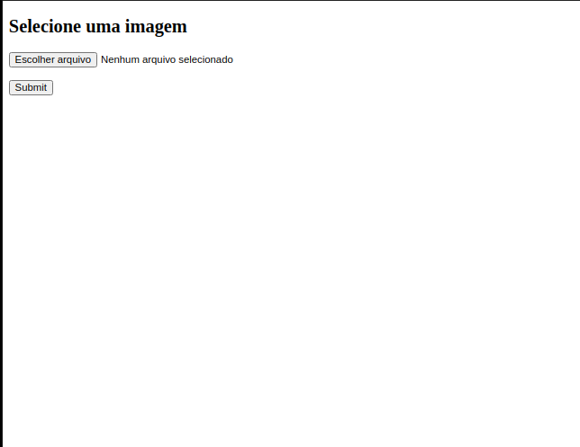
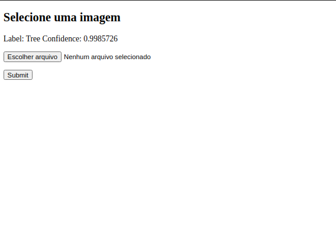

# Desafio Visão

Este repositório contém a proposta de solução para o desafio da empresa xxx, pelo candidato xxx.

## Descrição de arquivos

 Aqui estão contido os seguintes aquivos e suas breve descrição: 

- relatório[PDF]: Contém o relatório completo da solução, e os passo que foram tomados para decisão
- Data: Pasra que contém os arquivos com os dados das imagens para classificação, "soil" e "tree" 
- Weights: Pasta que contém os pesos e podemos salvos após o treinamento
- deploy: Pasta que contém os arquivos para execução da proposta como consumo em REST API
- Instructions[MD]: Arquivo que foi enviado com a descrição do arquivo
- requiriments[txt]: Arquivo com pacores para serem instalados para a execução do ambiente
- data_exploration[ipynb]: Um notebook que contém uma análise exploratória dos dados, com um breve descrição sobre cada passo, e as inferências obtidas;
- training[ipynb]: Um notebook que contém as propostas para resoluçãos dos problemas, métodos utilizados para o treinamento das redes e por fim uma avaliação de desepenho;
- explainable_ia[ipynb]: Um notebook que contém uma análise para validação dos dados obtidos após o treinamento, tentando entender para onde a rede está focando nas suas tomadas de decisão


## Instalação de requerimentos

Para a total execução dos arquivos e métodos é nescessárioa a instação de bibliotecas comprementárias, que pode ser adquiridas pelo arquivo requiriments.txt, e instlados pelo controlador de pacores pip:

```sh
pip install -r requirements.txt
```

## Ultilização dos Notebook

Os notebook estão contidos em suas celulas, cada um dele possui um breve descrição do passo que está sendo execultado. Para execução, é somente está disposto no diretório base, então executar:

```sh
jupyter notebook
```

## Deploy

O deploy foi executado baseado em um servidor Flask, com duas rotas, um que possui uma página HTML, ondé é possível submeter uma imagem para verificação, e uma rota para consumo

##### Aplicação Web

. Para executar considerando que estaj contido no diretório raiz, os seguintes comentados devem ser seguidos.

```sh
cd deploy
export FLASK_APP=index.py
flask run
```

Se senhuma porta for configura, o serviço deve está rodando na http://127.0.0.1:5000/ ou http://localhost:5000/. Ao acessar a página inicial você se deparará com a seguinte tela.



No canto superior direito ao clicar no botão escolher arquivo e submeter a image, você a sua predição, com a possível confiança. Tendo como retorno a segunda tela, que pode ser vizualizada abaixo.



##### Rest Api

A aplicação REST está sendo executada na rota "predict", dentro da pasta deploy existem dois exemplos para tests, que pode ser executados da seguinte forma:

```sh
cd deploy
curl -X POST -F file=@to_predict/0004_soil.png 'http://localhost:5000/predict'
```

```sh
cd deploy
curl -X POST -F file=@to_predict/0153_tree.png 'http://localhost:5000/predict'
```

Sendos as respostas esperadaras da predição:
```sh
{"predictions":[{"confidence":0.9999999999994152,"label":"Tree"}],"success":true}
```
```sh
{"predictions":[{"confidence":0.73402107,"label":"Tree"}],"success":true}
```
